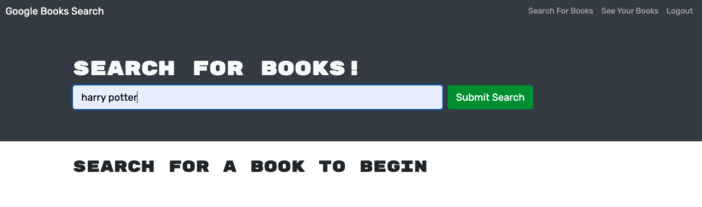
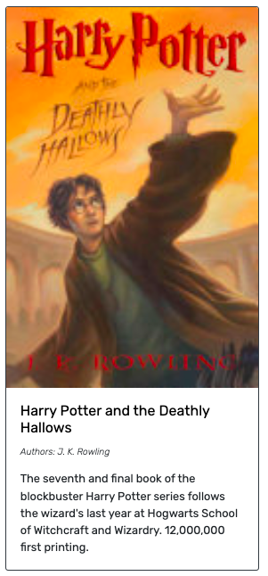

# Google Book Look

## Description
This will find the book you want by a keyword and let you save it as favorites so that you can use it as a reminder to purchase them later!

## Table of Contents
- [Website](#website)
- [Usage](#usage)
- [License](#license)
- [Questions](#questions)

## Website
https://still-citadel-50591.herokuapp.com/

## Usage
- Type in keyword and click submit to find your book. 
  [ Book Information ]
    - Image
    - Book title with link to the book on the Google Books site
    - Author
    - Description
  
  

- Save your books by a click of a button. 
  (You have to sign up or login to access this feature.)
  

- See your saved books from `See Your Books` tab. Delete books by clicking `Delete this Book!` button at the bottom of each book information.
  

- How to Sign up and Login
  1. Click `Login/Sign Up` tab.
  2. Click `Sign Up` tab to sign up and `Login` tab to login.
  3. Enter information and submit.
  
  

## License
Licensed under the [MIT License](https://opensource.org/licenses/MIT).
      

## Questions
- GitHub Profile: https://github.com/YuriI92
- If you have any additional questions, please feel free to contact me by email.
  E-mail Address: <yurichikawa1992@gmail.com>
      
  